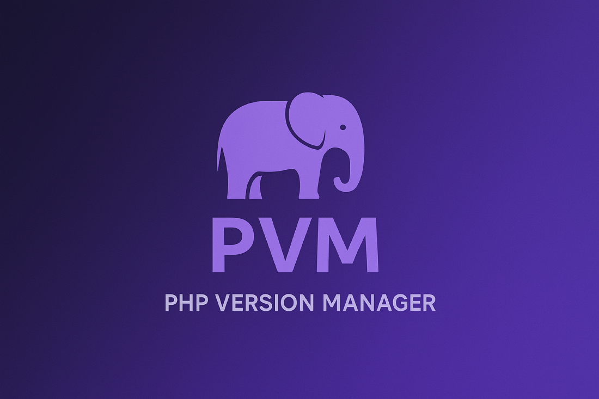

# 👋 Welcome to PVM



**PVM (PHP Version Manager)** is a lightweight tool for managing PHP on Windows.  
It helps you install, switch, and configure multiple PHP versions with ease.

---

## ✨ Features
- 🔀 Switch between PHP versions instantly (via symlinks).  
- ⚙️ Manage `php.ini` settings with simple commands.  
- 📦 Enable, disable, or check the status of PHP extensions.  
- 🛠️ Scripts written in PowerShell, easy to customize.  

---

## 🚀 Getting Started
Clone the repo and explore the available PowerShell functions:

```sh
git clone https://github.com/usepvm/pvm.git
cd pvm
```
